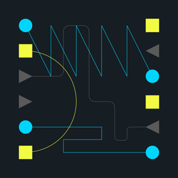

# Welcome to Max for Live Connection Kit

The Connection Kit is a collection of Max for Live devices that allow you to connect Ableton Live with several hardware or software technologies. Some of the devices provide a relatively generic interfacing framework between Live and a specific technology (e.g. Arduino, OSC Send), but most of them are only simple examples of what you can do. Their purpose is to show you how you can connect and as such they are meant to be taken apart, studied, extended or completely transformed.

The main core technologies that have been utilised in this pack are the following:

## MAX

Max is a visual programming environment for sound, graphics, music and interactivity developed by Cycling 74. It provides an interface for visually patching together programs to make interactive sounds, graphics and custom effects. Max For Live is a collaboration between Cycling 74 and Ableton that integrates the Max environment into Ableton Live and allows a user to edit and run Max based programs as Live devices. All the devices in the Connection Kit are written in Max with the intent of allowing users to adapt the devices to their specific needs and requirements by editing them inside the Max For Live editor or inside Max itself.

To learn more about how to program in Max visit our friends at Cycling 74 for some excellent [tutorials](https://cycling74.com/tutorials/popular/page/1).

## OSC

OSC (Open Sound Control) is an open-ended communication protocol used for networking multimedia devices. In their simplest form, OSC messages consist of a symbolic URL-style address introduced by a ‘/’ character, followed by a numeric value. In order to send OSC data from one device to another, the sender device needs to know the host address of the receiver. Then, for both sender and receiver we need to set the same port number (any number between 1024 - 65535); OSC data exchange is taking place over this port. Max provides two objects, “udpreceive” and “udpsend” that support a subset of the OSC protocol.

In this pack we have used OSC to connect with LeapMotion, Processing and TouchOSC.

To learn more about the OSC protocol go [here](http://opensoundcontrol.org/introduction-osc)

## JSON

JSON ((JavaScript Object Notation)) is a data exchange format, widely supported by web browsers. It is used to transmit information that is structured as attribute-value pairs and in this pack there are two example devices that are used to fetch web data formatted in JSON; JSON Weather and JSON Video. This is happening with the help of the “js” object in Max; this object executes the necessary javascript code that is making a call to a specific API.

In this pack we have used JSON based APIs with the JSON Video and JSON Weather device.

A detailed description of the JSON data format can be found [here](http://www.json.org/)

## ARDUINO / GENUINO

The Arduino/Genuino is an open hard- and software platform with physical in- and outputs based on a microcontroller. The physical in- and outputs of an Arduino/Genuino microcontroller allow for connecting sensors and actuators which can be accessed by a programming interface. This software interface provides access to the data coming from a variety of sensors and enables the control of LEDs, motors and other peripherals. The “serial” object provided by the Max visual programming environment allows for connecting an Arduino/Genuino via the USB port of a computer. The Arduino Max for Live device takes advantage of that connection and provides an interface for simple interaction between the Max platform and the in- and outputs of an Arduino/Genuino Uno microcontroller.

You can find lots of examples and tutorials at [arduino.cc](https://www.arduino.cc/).

## Maintainers

* [@crk-ableton](https://github.com/crk-ableton)
* [@lib-ableton](https://github.com/lib-ableton)

## Support

For help with any technical issues, please contact [Ableton Support](https://help.ableton.com/hc/requests/new?ticket_form_id=127269).
